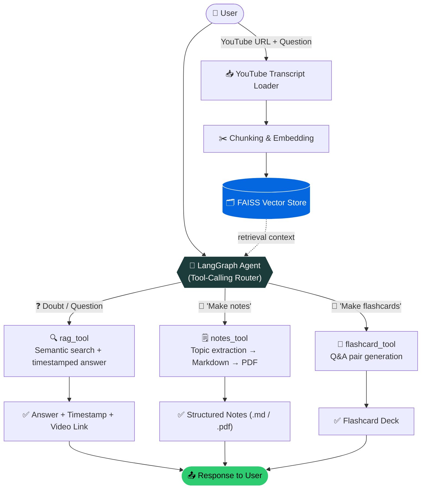
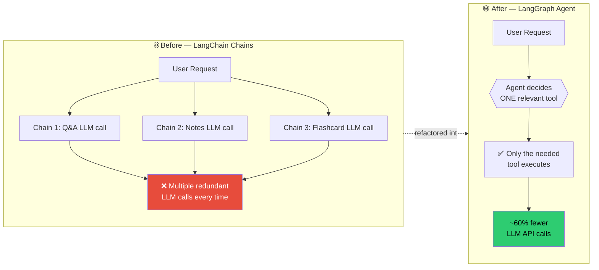

<div align="center">

# 🎬 YTube_AgentMind

### Turn any YouTube video into an interactive, queryable knowledge base

**Ask questions → Get timestamped answers → Generate notes → Build flashcards**
_All powered by a single LangGraph tool-calling agent._

[](https://www.python.org/)
[](https://langchain-ai.github.io/langgraph/)
[](https://www.langchain.com/)
[](https://github.com/facebookresearch/faiss)
[](https://fastapi.tiangolo.com/)
[](https://ollama.com/)

[Features](#-features) • [Architecture](#-architecture) • [Getting Started](#-getting-started) • [How It Works](#-how-it-works) • [Roadmap](#-roadmap)

</div>

---

## 📖 Overview

**YTube_AgentMind** is an agentic AI system built for students and lifelong learners. Drop in a YouTube video link, and the agent becomes your personal tutor for it — it can:

- 💬 **Answer any doubt** about the video's content, with the **exact timestamp + clickable link** to where the answer comes from
- 📝 **Generate detailed, topic-wise notes** as clean Markdown/PDF
- 🧠 **Create flashcards** for quick revision

Instead of a rigid, single-purpose script, the whole system runs as **one LangGraph agent** that reasons about what the user wants and dynamically decides which capability (tool) to invoke — making it feel less like a script and more like an actual study assistant.

> 💡 **Why this exists:** Long lecture/tutorial videos are hard to search, revise, or query. This agent turns unstructured video content into structured, revisable, and *searchable* knowledge — instantly.

---

## ✨ Features

| Capability | Description |
|---|---|
| 🎯 **Timestamped Q&A** | Ask any doubt about the video — get an answer *and* the exact moment + link it came from |
| 🗒️ **Auto Notes Generation** | Extracts topics from the transcript and generates structured, per-topic notes (Markdown → PDF) |
| 🎴 **Flashcard Generation** | Converts video content into revision-ready flashcards automatically |
| 🧭 **Agentic Tool Routing** | A single LangGraph agent decides *which* tool to call based on what you ask — no rigid menus |
| 🔎 **Advanced RAG** | FAISS-powered semantic retrieval over chunked transcripts for grounded, accurate answers |
| ⚡ **Optimized LLM Usage** | Re-architected from chained LLM calls to agentic tool-calling — **~60% fewer LLM API calls** |

---

## 🏗️ Architecture

The system evolved from a **linear LangChain chain pipeline** (a separate LLM call for Q&A, another for notes, another for flashcards) into a **single LangGraph tool-calling agent** that intelligently routes a user's request to the right tool — cutting redundant LLM calls by roughly **60%** and lowering cost.



### Before vs. After the LangGraph migration



---

## 🧰 Tech Stack

| Layer | Tools |
|---|---|
| **Agent Orchestration** | LangGraph (`ToolNode`, `tools_condition`, custom routing edges) |
| **LLM Framework** | LangChain |
| **Vector Store** | FAISS |
| **LLM Runtime** | nvidia/nemotron-3-ultra-550b-a55b  , mistral-small-latest , Ollama (local) |
| **Backend** | FastAPI |
| **Language** | Python |

---

## 📂 Project Structure

```
YTube_AgentMind/
├── src/               # Core agent logic, graph definition, tools, config
├── prompts/           # Prompt templates (QA, notes, flashcards)
├── outputs/           # Generated notes & flashcards (markdown/PDF)
├── main.py            # Entry point
├── requirements.txt   # Dependencies
└── yt_intelligence_chatbot.ipynb   # Notebook walkthrough / experimentation
```

---

## 🚀 Getting Started

### Prerequisites
- Python 3.10+
- Nvidia free API Key or Mistral Free API Key
- [Ollama](https://ollama.com/) installed and running locally (for local LLM inference)

### Installation

```bash
# 1. Clone the repository
git clone https://github.com/AsifKhan-001/YTube_AgentMind.git
cd YTube_AgentMind

# 2. Create a virtual environment
python -m venv venv
source venv/bin/activate     # On Windows: venv\Scripts\activate

# 3. Install dependencies
pip install -r requirements.txt

# 4. Run the agent
python main.py
```

Then just paste a YouTube URL and start chatting — ask a doubt, or say "generate notes" / "make flashcards" for that video.

---

## ⚙️ How It Works

1. **Ingest** — The video's transcript is fetched and split into overlapping chunks.
2. **Embed & Index** — Chunks are embedded and stored in a FAISS vector index for fast semantic retrieval.
3. **Route** — A LangGraph agent receives the user's message and decides which bound tool to call:
   - `rag_tool` → retrieves the most relevant transcript chunks and answers the doubt, citing the **timestamp + link**
   - `notes_tool` → extracts topics from the transcript and builds structured per-topic notes, exported as Markdown/PDF
   - `flashcard_tool` → converts key concepts into a flashcard deck
4. **Respond** — The graph loops back through `ToolNode` → `tools_condition` routing until the agent has a final answer, then returns it to the user.

This agentic design means **one unified graph handles Q&A, notes, and flashcards** — instead of three separate LLM chains firing on every request, only the tool that's actually needed gets called.

---

## 🗺️ Roadmap

- [ ] Multi-video knowledge base (query across a playlist)
- [ ] Web UI (beyond notebook/CLI)
- [ ] Support for additional local + hosted LLM providers
- [ ] Persistent conversation memory across sessions
- [ ] Exportable flashcard decks (Anki format)

---

## 🤝 Contributing

Contributions, issues, and feature requests are welcome! Feel free to check the [issues page](https://github.com/AsifKhan-001/YTube_AgentMind/issues).

---

## 👤 Author

**Asif Khan**
B.Tech, Delhi Technological University · AI/ML Learner

[](https://github.com/AsifKhan-001)
[](https://www.linkedin.com/in/asifkhan001/)

---

<div align="center">

⭐ If you find this project useful, consider giving it a star!

</div>
