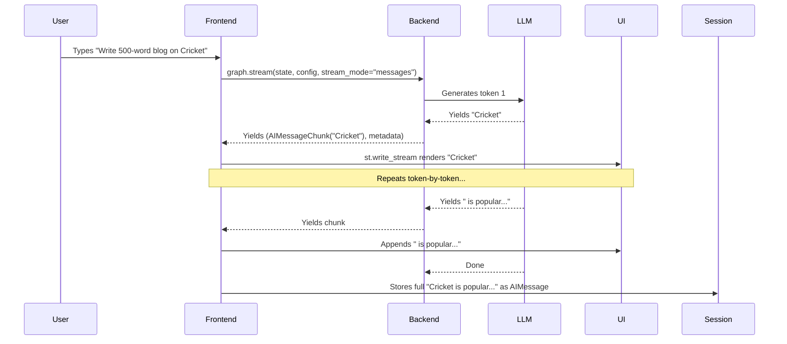

# Lecture Notes


---

# Project Context and Feature Evolution

## What is it?

- **Project Context**: This lecture continues a series on building an **Agentic AI Chatbot using LangGraph**. The project has evolved incrementally:
  1. **Basic Chatbot** — Direct LLM interaction with no memory.
  2. **Short-term Memory** — Chatbot remembers conversation history within a session.
  3. **UI Integration** — Added a Streamlit frontend for user interaction.
  4. **Current Feature: Streaming** — Solving the "all-at-once" response problem for long outputs.

- **Technical Definition of Streaming**:  
  In LLMs, **streaming** means the model sends tokens **as soon as they are generated**, instead of waiting for the entire response to be ready before returning it.

> **Core Difference**:  
> - **Non-streaming (Invoke)**: LLM thinks → generates full answer → sends complete response.  
> - **Streaming (Stream)**: LLM generates token → sends token immediately → user sees typewriter effect.

---

## Why do we need it?

### The Problem
When a user requests a long output (e.g., "Write a 500-word blog on Cricket"), the UI **freezes/blanks out** for 5–10 seconds while the LLM generates the full response. Then the entire text appears abruptly.

### Key Benefits of Streaming

| Benefit | Explanation |
|---------|-------------|
| **Faster Perceived Response Time** | User sees output immediately; no "frozen" UI. Prevents non-technical users from thinking the app crashed. |
| **Mimics Human Conversation** | Typewriter effect feels alive, builds trust, keeps user engaged (like ChatGPT). |
| **Essential for Multimodal UI** | Voice agents (e.g., Alexa) cannot wait 10s before speaking; streaming enables seamless conversation flow. |
| **Better UX for Code/Structured Output** | Token-by-token rendering helps users parse code logic line-by-line. |
| **Early Stop / Token Savings** | User can halt generation mid-way → saves tokens → saves money (LLM providers charge per token). |
| **Agent Step Visibility** | For AI Agents, streaming shows intermediate steps (e.g., "Opening BookMyShow → Selecting Movie → Payment") reducing uncertainty. |

> **In a nutshell**: Streaming improves User Experience **10x** with minimal code changes.

---

## How does it work?

### Backend (LangGraph) Changes

1. **Replace `graph.invoke()` with `graph.stream()`**  
   - `invoke()` returns the final state.  
   - `stream()` returns a **Python Generator** (yields values on-the-fly).

2. **Provide three arguments to `stream()`**:
   - **Initial State** — e.g., `{"messages": [HumanMessage(content="...")]}`
   - **Config** — Contains `thread_id` for memory persistence.
   - **Stream Mode** — Set to `"messages"` to receive LLM tokens as chunks.

3. **Generator Output Structure**  
   Each iteration yields a tuple: `(message_chunk, metadata)`  
   - `message_chunk.content` → the actual token string.  
   - `metadata` → extra info (node name, run_id, etc.).

4. **Consume the Generator**  
   ```python
   for message_chunk, metadata in graph.stream(...):
       if message_chunk.content:
           print(message_chunk.content, end=" ", flush=True)
   ```

### Frontend (Streamlit) Changes

1. **Use `st.write_stream(generator)`**  
   - Built-in Streamlit function that consumes a generator and renders tokens with a typewriter effect automatically.
   - Handles all UI rendering internally.

2. **Integration Pattern**:
   ```python
   with st.chat_message("assistant"):
       # Create generator inline
       stream_generator = (
           msg_chunk.content 
           for msg_chunk, _ in chatbot.stream(
               {"messages": [HumanMessage(content=user_input)]},
               config=config,
               stream_mode="messages"
           )
       )
       # Render + capture full response
       ai_message = st.write_stream(stream_generator)
   
   # Save to session history
   st.session_state.messages.append(AIMessage(content=ai_message))
   ```

3. **No Backend Logic Change Required**  
   The LangGraph graph definition remains identical; only the **execution method** changes from `invoke` → `stream`.

---

## Real World Example

| Scenario | Without Streaming | With Streaming |
|----------|-------------------|----------------|
| **ChatGPT-like Chat** | User waits 8s staring at blank screen → full essay appears. | Words appear instantly; user starts reading while generation continues. |
| **Voice Assistant (Alexa)** | 10s silence → sudden long speech. Feels like bad signal. | Assistant speaks as it "thinks"; natural conversation flow. |
| **Code Generation** | Entire 100-line file dumps at once; hard to follow. | Lines appear sequentially; user comprehends structure in real-time. |
| **Agent Booking Ticket** | 60s silence → "Booked!" (User anxious). | "Searching flights... Selecting seat... Processing payment..." — transparency. |

> **Analogy**: Streaming is like **reading a book aloud as you write it** vs. **handing over the finished manuscript**.

---

## Important Points

- **Generator Basics**: A Python generator uses `yield` instead of `return`. It produces values lazily, one at a time, preserving state between yields.
- **LangGraph Stream Modes**:
  - `"messages"` → LLM token chunks (used here).
  - `"values"` → Full state after each node.
  - `"updates"` → State deltas per node.
  - `"custom"` → User-defined via `StreamWriter`.
- **`st.write_stream()`** expects an **iterable of strings** (or a generator yielding strings).
- **Memory Persistence**: `config={"configurable": {"thread_id": "..."}}` must be passed to both `invoke` and `stream` for conversation continuity.
- **Token Savings**: Early termination = fewer generated tokens = lower API cost.

---

## Common Mistakes

1. **Hardcoding the Prompt in Backend Test**  
   Forgetting to replace `"What is the recipe to make pasta?"` with the actual `user_input` variable → chatbot always answers the same question.

2. **Using Wrong Stream Mode**  
   Using `"values"` or `"updates"` when you need token-level streaming → yields full state objects, not `message_chunk.content`.

3. **Not Unpacking the Tuple**  
   `graph.stream()` yields `(chunk, metadata)`. Forgetting `for chunk, _ in ...` causes attribute errors.

4. **Forgetting to Save Final Response to Session**  
   `st.write_stream()` returns the full concatenated string. If not saved to `st.session_state.messages`, history breaks.

5. **Leaving Debug Prints in Production Code**  
   `print(type(stream))` or raw `print(chunk)` clutters logs and confuses beginners.

---

## Interview Questions

1. **What is the difference between `graph.invoke()` and `graph.stream()` in LangGraph?**  
   *Answer*: `invoke` blocks until full execution and returns final state; `stream` returns a generator yielding intermediate outputs (chunks) in real-time based on the selected `stream_mode`.

2. **Why is `stream_mode="messages"` specifically used for token-level streaming?**  
   *Answer*: This mode emits `(message_chunk, metadata)` tuples directly from the LLM node, where `message_chunk.content` contains individual tokens. Other modes emit full state or deltas.

3. **How does `st.write_stream()` simplify frontend streaming implementation?**  
   *Answer*: It accepts any generator/iterable of strings, automatically renders each chunk with a typewriter effect, and returns the full concatenated response for history storage — no manual placeholder/loop logic needed.

4. **Explain how streaming helps reduce LLM API costs.**  
   *Answer*: If the user stops generation mid-way (clicks "Stop"), the provider only bills for tokens actually generated, not the full intended response.

5. **What changes are required in the LangGraph graph definition to enable streaming?**  
   *Answer*: **None.** The graph structure (nodes, edges, state schema) remains unchanged. Only the **execution call** changes from `.invoke()` to `.stream()` with appropriate parameters.

---

## Revision Notes

- **Project Evolution**: Basic Bot → Memory → UI → **Streaming** (current).
- **Streaming Definition**: Token-by-token emission as generated (Generator pattern).
- **Core Problem Solved**: Blank UI during long generation; poor perceived latency.
- **Backend**: `graph.stream(state, config, stream_mode="messages")` → Generator.
- **Generator Yield**: `(message_chunk, metadata)` → access `message_chunk.content`.
- **Frontend**: `st.write_stream(generator)` → auto typewriter effect + returns full text.
- **Config**: Must include `thread_id` for memory continuity.
- **Stream Modes**: `"messages"` (tokens), `"values"` (full state), `"updates"` (deltas), `"custom"`.
- **Benefits**: UX, trust, multimodal readiness, code readability, cost control, agent transparency.
- **Key Mistake**: Hardcoding test prompt instead of using `user_input`.


---

# Non-Streaming UX Limitations Demo

## What is it?

**Non-Streaming UX** refers to the traditional request-response pattern where an LLM generates the **entire response internally** before sending it to the user interface in a **single payload**.

- **Simple Explanation**: You ask a question, the screen stays blank while the model "thinks," and then suddenly the complete answer appears all at once — like receiving a sealed letter instead of watching someone write it.
- **Technical Explanation**: In LangGraph, this is implemented via `graph.invoke()`, which blocks execution until the full graph state is resolved. The frontend receives only the final `AIMessage` object, resulting in **zero incremental feedback** during generation.

> **Key Distinction**: Non-streaming = **All-or-nothing delivery**. Streaming = **Token-by-token delivery** (typewriter effect).

***

## Why do we need it? (The Problems with Non-Streaming)

The demo highlights **four critical UX failures** when streaming is absent:

| Problem | Impact | Real-World Analogy |
|--------|--------|-------------------|
| **Perceived Latency** | User stares at blank screen for 5–10+ seconds | Calling a restaurant and hearing silence for minutes before they say "Hello" |
| **Abrupt Cognitive Load** | 500+ words dump instantly, overwhelming reading flow | Being handed a 10-page document and told "Read this now" |
| **No Interruptibility** | Cannot stop generation mid-way; wastes tokens & money | Printing a 100-page report just to realize page 2 has an error |
| **Zero Progress Visibility** | Impossible to show agent steps (tool calls, searches, etc.) | GPS that only says "Arrived" — no turn-by-turn directions |

> **Core Insight**: Non-streaming breaks the **illusion of conversation**. Humans speak incrementally; LLMs should too.

***

## How does it work? (Technical Flow of the Limitation)

### Current Non-Streaming Implementation (The Problem)

1. **Backend (LangGraph)**: `graph.invoke(initial_state, config)`
   - Blocks until **entire graph execution completes**
   - Returns final state with complete `AIMessage`
2. **Frontend (Streamlit)**:
   ```python
   response = graph.invoke(...)  # Blocks here
   st.chat_message("assistant").write(response["messages"][-1].content)
   ```
   - Single `write()` call dumps full text instantly
3. **User Experience**: Blank screen → Sudden wall of text

### What Streaming Changes (The Solution Preview)

| Component | Non-Streaming | Streaming |
|----------|---------------|-----------|
| **Graph Method** | `.invoke()` | `.stream()` |
| **Return Type** | Final State (Dict) | Generator of `(message_chunk, metadata)` |
| **Frontend Rendering** | `st.write(full_text)` | `st.write_stream(generator)` |
| **Control Flow** | Synchronous blocking | Asynchronous iteration |

> **Note**: The demo shows that **backend logic stays identical** — only the execution method and frontend rendering change.

***

## Real World Example

### Scenario: Recipe Request
- **User**: *"Write a 500-word blog on cricket in India"*
- **Non-Streaming UX**:
  - 8 seconds of frozen chat bubble
  - Suddenly: 500 words appear → User scrolls frantically to find beginning
  - If user hates paragraph 3, they must regenerate entire thing (wasted tokens)
- **Streaming UX** (shown in demo):
  - First token appears in **<500ms**
  - Words flow like live typing → User reads *while* generating
  - User clicks "Stop" at word 200 → **Saves 300 tokens** = saves money

### Multimodal Analogy: Voice Assistant (Alexa/Siri)
- **Without streaming**: You ask "How to cook pasta?" → 10s silence → Sudden 2-min monologue
- **With streaming**: "First, boil water..." → "Add salt..." → "Drop pasta..." (natural pause rhythm)

***

## Important Points

- **`graph.stream()` returns a Python Generator** — uses `yield` internally for lazy evaluation
- **Stream Modes in LangGraph**:
  - `"messages"` → Token-by-token LLM output (used for chat)
  - `"updates"` → Node-level state changes (used for agent progress)
  - `"values"` → Full state after each node
  - `"custom"` → Developer-defined events
- **`st.write_stream(generator)`** handles:
  - Typewriter animation
  - Buffering
  - Final concatenation into single string
- **Token Savings = Cost Savings**: LLMs billed per token; stopping early = direct $ savings
- **Streaming ≠ WebSockets**: Here, streaming is **server-side generator → HTTP chunked response**, not persistent connection

***

## Common Mistakes

| Mistake | Consequence | Fix |
|--------|-------------|-----|
| Using `graph.invoke()` but expecting incremental UI | Blank screen until full response | Switch to `graph.stream(mode="messages")` |
| Forgetting `stream_mode="messages"` | Gets full state objects, not token chunks | Explicitly pass `stream_mode="messages"` |
| Passing hardcoded prompt instead of `user_input` | Chatbot ignores user, repeats same answer | Use `HumanMessage(content=user_input)` |
| Not wrapping stream in `st.chat_message("assistant")` | Tokens render outside chat bubble | Use context manager: `with st.chat_message("assistant"): st.write_stream(...)` |
| Ignoring generator cleanup | Memory leaks in long conversations | Consume generator fully or handle `StopIteration` |

***

## Interview Questions

1. **What is the fundamental difference between `graph.invoke()` and `graph.stream()` in LangGraph?**
   - *Answer*: `invoke()` blocks and returns final state; `stream()` returns a generator yielding incremental chunks (token-level when `mode="messages"`).

2. **Why does non-streaming UX cause higher perceived latency even if total generation time is identical?**
   - *Answer*: Zero visual feedback during generation → user assumes freeze/crash. Streaming provides **time-to-first-token (TTFT)** < 500ms, creating immediate responsiveness illusion.

3. **How does streaming enable token-cost optimization in production LLM apps?**
   - *Answer*: Users can interrupt generation mid-stream (via "Stop" button). Ungenerated tokens are never produced → direct reduction in provider billing (OpenAI, Anthropic charge per output token).

4. **Explain the role of `st.write_stream()` in Streamlit. What does it abstract away?**
   - *Answer*: It consumes a generator, renders tokens with typewriter animation, handles buffering/flushing, and returns the concatenated final string for session storage — no manual loop/print logic needed.

5. **When would you choose `stream_mode="updates"` over `"messages"`?**
   - *Answer*: For **agentic workflows** where you want to show *tool calls, node transitions, or custom progress events* (e.g., "Searching web...", "Calling API...") rather than just LLM tokens.

***

## Revision Notes

- **Non-Streaming = `invoke()`** → Blocks → Returns **complete** `AIMessage` → **All-at-once** UI dump
- **Streaming = `stream(mode="messages")`** → Returns **Generator** → Yields `(chunk, metadata)` → **Token-by-token** UI flow
- **Three UX Killers of Non-Streaming**:
  1. Blank-screen wait (perceived lag)
  2. Cognitive overload (wall of text)
  3. No interrupt = wasted tokens/$
- **Streamlit Integration**: `with st.chat_message("assistant"): full_response = st.write_stream(graph.stream(...))`
- **Generator Pattern**: `for chunk, _ in graph.stream(...): yield chunk.content` → consumed by `write_stream`
- **Business Value**: Streaming → Better UX + Token savings + Agent observability → **10x UX improvement** (per instructor)


---

# Streaming Definition and Typewriter Effect

## What is it?

### Simple Explanation
**Streaming** is a technique where an LLM sends tokens (words/characters) to the user **as soon as they are generated**, instead of waiting for the entire response to be ready. This creates a **typewriter effect** — the text appears on screen character-by-character or word-by-word, just like someone is typing it in real time.

> **Think of it like this:** Instead of receiving a sealed letter all at once, you're watching someone write the letter right in front of you, word by word.

### Technical Explanation
In LLM applications, there are two ways to receive responses:

| Approach | Description |
|----------|-------------|
| **Non-Streaming (Invoke)** | The model generates the **complete response internally**, then returns it as a single block. The user sees nothing until the full response is ready. |
| **Streaming (Stream)** | The model **yields tokens incrementally** as they are produced. The frontend receives a **generator/iterator** that emits tokens one at a time, enabling real-time rendering. |

In **LangGraph**, this is implemented by replacing `graph.invoke()` with `graph.stream()`, which returns a **Python generator object**. This generator yields tuples of `(message_chunk, metadata)` for each token produced by the LLM.

---

## Why do we need it?

### The Problem It Solves
When a chatbot generates long outputs (e.g., a 500-word blog, code, or essay) **without streaming**:
- The UI **freezes** for 5–10+ seconds while the LLM processes.
- The user sees a **blank screen** — no feedback, no indication of progress.
- Non-technical users may think the app **crashed or hung**, leading to **drop-offs**.
- The full response dumps at once, making it **hard to read and parse** (especially code).

### Why It Is Important
1. **Faster Perceived Response Time**  
   Users see output **immediately**, even if generation takes time. Eliminates "is it working?" anxiety.

2. **Mimics Human Conversation**  
   The typewriter effect **feels alive** — like talking to a real person. Builds trust and keeps users engaged.

3. **Essential for Multimodal/Voice UIs**  
   In voice assistants (e.g., Alexa), silence while "thinking" breaks conversational flow. Streaming enables **incremental speech synthesis**.

4. **Better UX for Long Outputs (Code, Logs, Essays)**  
   Reading code line-by-line as it appears is **far easier** than parsing a sudden 200-line block.

5. **Early Termination Saves Tokens & Money**  
   Users can **stop generation mid-way** if the response is off-track. Since LLM providers charge per token, this **directly reduces costs**.

6. **Enables Real-Time Agent Updates**  
   Beyond LLM text, streaming can show **agent steps**: "Searching web...", "Found URL...", "Booking ticket...", "Payment processing...". Critical for transparency in agentic workflows.

> **Bottom Line:** Streaming can **10x the user experience** of any LLM app. It's a small implementation effort for massive UX gains.

---

## How does it work?

### Step-by-Step Implementation (LangGraph + Streamlit)

#### Backend (LangGraph)
1. **Build your graph** as usual (StateGraph with nodes, edges, checkpointer).
2. **Replace `graph.invoke(input, config)` with `graph.stream(input, config, stream_mode="messages")`**.
   - `stream_mode="messages"` yields LLM tokens as `(message_chunk, metadata)` tuples.
3. The call returns a **Python generator** (lazy iterator using `yield`).

#### Frontend (Streamlit)
4. **Wrap the generator in `st.write_stream()`** inside `st.chat_message("assistant")`.
   - `st.write_stream()` accepts a generator yielding strings and renders them with a **typewriter effect** automatically.
5. **Extract token content** from each chunk:  
   ```python
   for message_chunk, metadata in graph.stream(...):
       if message_chunk.content:
           yield message_chunk.content
   ```
6. **Capture full response** after streaming completes to store in session state (chat history).

### Code Flow Summary
```
User Input
    ↓
graph.stream(input, config, stream_mode="messages")
    ↓
Returns Generator[(message_chunk, metadata)]
    ↓
Loop over generator → yield message_chunk.content
    ↓
st.write_stream(generator) → Renders typewriter effect
    ↓
Full response captured → saved to session_state
```

---

## Real World Example

### Analogy: Watching a Chef Cook vs. Getting a Finished Dish
- **Non-streaming:** You order pasta. Wait 15 minutes in silence. Suddenly, a full plate appears. You had no idea what was happening.
- **Streaming:** You sit at the kitchen counter. You see the chef boil water, add pasta, stir sauce, plate it — **step by step**. You're engaged, informed, and can say "stop, less salt" halfway through.

### Daily Life Examples
| Scenario | Without Streaming | With Streaming |
|----------|-------------------|----------------|
| **ChatGPT** | Blank screen → full essay appears | Words flow as you read |
| **Code Assistant** | 200-line file dumps at once | Functions appear line-by-line |
| **Voice Assistant** | 10s silence → sudden speech | Speaks while "thinking" |
| **Travel Booking Agent** | "Done!" after 60s | "Searching flights... Selecting seat... Paying..." |

---

## Important Points

- **`graph.stream()` returns a generator**, not a final state. Requires iteration.
- **`stream_mode="messages"`** is specifically for token-by-token LLM output.
- Other stream modes exist: `"values"`, `"updates"`, `"custom"` — used for agent step visibility (covered in later videos).
- **`st.write_stream()`** is a Streamlit utility that consumes any generator of strings and renders the typewriter effect natively.
- **Generators use `yield`** (not `return`) — they produce values **on-demand**, enabling memory-efficient streaming.
- **Always capture the final response** after streaming to maintain chat history in `st.session_state`.
- **No backend logic changes needed** — only the invocation method (`invoke` → `stream`) and frontend rendering.

---

## Common Mistakes

| Mistake | Consequence | Fix |
|---------|-------------|-----|
| Using `graph.invoke()` instead of `graph.stream()` | No streaming; full response blocks UI | Replace with `graph.stream(..., stream_mode="messages")` |
| Forgetting `stream_mode="messages"` | Gets full state updates, not token chunks | Explicitly set `stream_mode="messages"` |
| Not iterating the generator | Nothing renders; generator exhausted silently | Wrap in `st.write_stream()` or manual `for` loop |
| Hardcoding prompt instead of using `user_input` | Same response every time | Pass dynamic `user_input` in `HumanMessage` |
| Not saving final response to session state | Chat history breaks after reload | Collect chunks → join → save as `AIMessage` |
| Ignoring `metadata` in tuple unpacking | ValueError: too many values to unpack | Use `for msg_chunk, metadata in stream:` |

---

## Interview Questions

1. **What is the difference between `graph.invoke()` and `graph.stream()` in LangGraph? When would you use each?**
2. **Explain how Python generators enable streaming in LLM applications. Why is `yield` critical here?**
3. **Why is `stream_mode="messages"` used for chat UIs? What do the two elements in the yielded tuple represent?**
4. **How does streaming improve user experience in three distinct ways? Give a real-world example for each.**
5. **In a Streamlit + LangGraph app, how do you capture the complete streamed response for chat history persistence?**

---

## Revision Notes

- **Streaming = Token-by-token output** as LLM generates (typewriter effect).
- **Core problem:** Long LLM responses freeze UI → user thinks app crashed.
- **Key benefits:** Faster perceived latency, human-like feel, enables early stop (saves tokens/cost), better readability for code/long text, supports agent step visibility.
- **LangGraph:** Use `graph.stream(input, config, stream_mode="messages")` → returns **generator**.
- **Generator yields:** `(message_chunk, metadata)` — extract `message_chunk.content`.
- **Streamlit:** Use `st.write_stream(generator)` inside `st.chat_message("assistant")` for auto typewriter rendering.
- **Always save full response** to `st.session_state` after streaming ends.
- **No backend logic change** — only invocation + frontend rendering.
- **Generators = lazy iterators** using `yield` — produce values on-demand, memory efficient.

***


---

# Streaming Benefits for LLM Applications

## What is it?

**Streaming** in LLMs means the model starts sending tokens **as soon as they are generated**, instead of waiting for the entire response to be ready before returning it.

- **Simple Explanation**: Imagine talking to someone who types their reply letter-by-letter in real-time, like a typewriter, rather than writing the whole essay first and handing it to you all at once.
- **Technical Explanation**: When you call an LLM, there are two ways to receive the output:
  1. **Non-Streaming (Invoke)**: The model generates the complete response internally, then sends the full payload in one go. The user sees nothing until the full response is ready.
  2. **Streaming (Stream)**: The model yields tokens incrementally via a **generator/iterator**. The client receives chunks (tokens) one by one and can render them immediately.

> **Key Insight**: Streaming transforms the LLM response from a **blocking synchronous call** into an **asynchronous token stream**, enabling real-time UX.

---

## Why do we need it?

### The Problem (Non-Streaming Behavior)
- User sends a prompt requesting long output (e.g., "Write a 500-word blog on Cricket").
- UI freezes/blank screen for 5–10 seconds while LLM generates full response.
- Sudden dump of entire text appears at once.
- **Result**: Poor readability, user thinks app froze, high drop-off for non-technical users.

### Benefits of Streaming

| # | Benefit | Explanation |
|---|---------|-------------|
| 1 | **Faster Perceived Latency** | First token appears instantly. User sees progress immediately, reducing perceived wait time. Prevents "app frozen" confusion. |
| 2 | **Mimics Human Conversation** | Typewriter effect feels alive and engaging. Builds trust; keeps user anticipating next token (like ChatGPT). |
| 3 | **Essential for Multimodal/Voice UIs** | Voice assistants (Alexa-style) cannot wait 10s before speaking. Streaming enables seamless, low-latency speech synthesis. |
| 4 | **Better UX for Code/Structured Output** | Code printed line-by-line is easier to parse mentally vs. a sudden wall of code. |
| 5 | **Early Stop / Token Savings** | User can halt generation mid-stream if response is wrong. Saves tokens → **saves money** (LLMs billed per token). |
| 6 | **Progress Updates for Agents** | In agentic workflows, stream intermediate steps (e.g., "Opening BookMyShow → Selecting Movie → Payment...") to reduce uncertainty during long tool chains. |

> **Nutshell**: Streaming is a *small technical change* that **10x improves User Experience**.

---

## How does it work?

### Backend (LangGraph) – Step by Step

1. **Define Graph** – Build your LangGraph agent/chatbot as usual.
2. **Replace `.invoke()` with `.stream()`**  
   - `.invoke(input, config)` → returns final state (blocking).  
   - `.stream(input, config, stream_mode="messages")` → returns a **Python Generator** yielding `(message_chunk, metadata)` tuples.
3. **Choose `stream_mode="messages"`** – This mode streams LLM tokens specifically. Other modes (`updates`, `values`, `custom`) are for tool/agent step streaming.
4. **Iterate the Generator** – Loop over the generator to extract `message_chunk.content` token-by-token.

```python
# Old (blocking)
response = chatbot.invoke(initial_state, config)

# New (streaming)
stream = chatbot.stream(
    initial_state,
    config,
    stream_mode="messages"  # critical for token-level streaming
)
for message_chunk, metadata in stream:
    if message_chunk.content:
        print(message_chunk.content, end=" ", flush=True)
```

### Frontend (Streamlit) – Step by Step

1. **Keep Backend Unchanged** – Expose a function that returns `chatbot.stream(...)` generator.
2. **Use `st.write_stream(generator)`** – Streamlit's built-in helper consumes a generator and renders tokens with typewriter effect automatically.
3. **Capture Final Response** – `st.write_stream` returns the full concatenated string; store it in session state for history.

```python
# Inside Streamlit chat loop
with st.chat_message("assistant"):
    # Create generator that yields token strings
    def token_generator():
        stream = chatbot.stream(
            {"messages": [HumanMessage(content=user_input)]},
            config,
            stream_mode="messages"
        )
        for msg_chunk, _ in stream:
            if msg_chunk.content:
                yield msg_chunk.content

    # Render + capture full response
    ai_message = st.write_stream(token_generator())

# Save to history
st.session_state.messages.append({"role": "assistant", "content": ai_message})
```

---

## Real World Example

### Analogy: **Pizza Delivery vs. Live Cooking Station**
- **Non-Streaming (Pizza Delivery)**: You order, wait 30 mins with *zero updates*, then get the whole pizza at once. You don't know if it's being made, baked, or boxed.
- **Streaming (Live Cooking Station)**: You watch the chef stretch dough, add sauce, sprinkle cheese, slide into oven, slice, box. You see progress every second. If you hate pineapple, you shout "Stop!" before it goes in.

### Daily Life Scenarios
1. **ChatGPT / Claude** – Typewriter effect keeps you reading.
2. **GitHub Copilot** – Code appears line-by-line; you accept/reject instantly.
3. **Voice Assistants** – Streaming TTS starts speaking before full sentence ready.
4. **AI Travel Agent** – Streams: "Searching flights… Found 3 options… Booking seat 12A… Payment done."

---

## Important Points

- **Generator ≠ List**: A generator yields values *on-demand* (lazy evaluation), saving memory. Use `yield`, not `return`.
- **`stream_mode="messages"`** is mandatory for token-level LLM streaming in LangGraph.
- **`st.write_stream()`** handles buffering, rendering, and final concatenation – no manual `st.empty()` + `st.markdown()` loops needed.
- **Config (thread_id)** must be passed to both `invoke` and `stream` for memory/checkpointing.
- **Stopping mid-stream** = fewer output tokens generated = lower API cost.
- **Streaming works with tools/agents too** – use `stream_mode="updates"` or `"values"` to see tool calls/results in real-time.

---

## Common Mistakes

| Mistake | Why It Breaks | Fix |
|---------|---------------|-----|
| Forgetting `stream_mode="messages"` | Default mode streams full state updates, not tokens. | Explicitly set `stream_mode="messages"`. |
| Passing hardcoded prompt instead of `user_input` | Backend ignores actual user query. | Use variable: `HumanMessage(content=user_input)`. |
| Not capturing `st.write_stream()` return value | Assistant reply lost from chat history. | Assign: `ai_message = st.write_stream(...)`. |
| Using `.invoke()` but expecting streaming | `.invoke()` blocks until complete. | Switch to `.stream()`. |
| Iterating generator incorrectly (e.g., `for chunk in stream:` without unpacking) | Stream yields tuples `(chunk, metadata)`. | Unpack: `for msg_chunk, metadata in stream:`. |

---

## Interview Questions

1. **What is the difference between `graph.invoke()` and `graph.stream()` in LangGraph?**  
   *Answer*: `invoke` blocks and returns final state; `stream` returns a generator yielding incremental chunks per `stream_mode`.

2. **Why is `stream_mode="messages"` used for chat streaming?**  
   *Answer*: It emits individual LLM message chunks (tokens) as they are generated, enabling typewriter effect. Other modes emit tool calls, state diffs, or custom events.

3. **How does streaming reduce LLM API costs?**  
   *Answer*: User can interrupt generation early; only tokens up to interruption are generated and billed.

4. **Explain how `st.write_stream()` simplifies frontend streaming in Streamlit.**  
   *Answer*: It accepts a generator, renders tokens incrementally with typewriter animation, and returns the full concatenated string for history persistence – no manual placeholder management.

5. **In an agentic workflow, which `stream_mode` would you use to show tool execution steps (e.g., "Searching web…", "Calling API…")?**  
   *Answer*: `stream_mode="updates"` or `"values"` – these emit node/state updates after each tool/node execution.

---

## Revision Notes

- **Streaming** = Token-by-token output via generator (`yield`).
- **LangGraph**: `graph.stream(..., stream_mode="messages")` → generator of `(chunk, metadata)`.
- **Frontend**: `st.write_stream(generator)` → auto typewriter UI + returns full text.
- **Benefits**: Perceived speed, human feel, voice-ready, code readability, early stop (cost), agent progress.
- **Key Config**: Pass `config={"configurable": {"thread_id": "..."}}` for memory.
- **Stop Early** → Save tokens → Save money.
- **Modes**: `messages` (tokens), `updates`/`values` (agent steps), `custom` (arbitrary).

***


---

# LangGraph Invoke vs Stream Mechanism

## What is it?

**Streaming** in LLMs means the model starts sending tokens as soon as they are generated, instead of waiting for the entire response to be ready before returning it.

### Simple Explanation
Imagine ordering food at a restaurant:
- **Invoke (Batch Mode)**: The chef cooks the entire meal in the kitchen, plates it perfectly, and brings it out all at once. You sit waiting with nothing happening until the complete dish arrives.
- **Stream (Streaming Mode)**: The chef brings out each course as it's ready — appetizer first, then soup, then main course. You start eating immediately while the rest is still being prepared.

### Technical Explanation
- **`graph.invoke()`**: Executes the entire graph, waits for the LLM to generate the complete response, then returns the final state object all at once.
- **`graph.stream()`**: Returns a Python **generator object** that yields output incrementally as the graph executes. Each yield provides a **message chunk** (containing the token) and **metadata**.
- **Generator**: A special iterator that produces values on-the-fly using `yield` instead of `return`, enabling memory-efficient, lazy evaluation.

***

## Why do we need it?

### The Problem with `invoke()`
When requesting long outputs (e.g., a 500-word blog, code generation), the UI freezes for 5–10 seconds while the LLM generates the full response. Then the entire text appears abruptly.

### Key Benefits of Streaming

| Benefit | Description |
|---------|-------------|
| **Faster Perceived Response Time** | User sees output immediately — no "frozen" UI. Prevents non-technical users from thinking the app crashed. |
| **Human-Like Conversation** | Mimics natural typing behavior. Builds trust, feels alive, keeps user engaged ("What's next?"). |
| **Better UX for Long Outputs (Code, Essays)** | Token-by-token rendering lets users parse structure incrementally (e.g., code line-by-line). |
| **Mid-Response Interruption** | Users can stop generation if unsatisfied → saves tokens → saves money (LLM providers charge per token). |
| **Agent Progress Updates** | For AI agents, stream intermediate steps (e.g., "Opening BookMyShow → Selecting Movie → Selecting Seats → Processing Payment"). Reduces uncertainty during long operations. |

> **Key Insight**: Streaming is a small technical change that delivers a **10x improvement in User Experience**.

***

## How does it work?

### Step-by-Step Implementation in LangGraph

#### 1. Backend Change (Minimal)
Replace `graph.invoke()` with `graph.stream()`:

```python
# OLD: Blocking invoke
result = chatbot.invoke(initial_state, config=config)

# NEW: Streaming returns a generator
stream = chatbot.stream(
    input=initial_state,           # 1. Initial state (e.g., HumanMessage)
    config=config,                 # 2. Config (thread_id for memory)
    stream_mode="messages"         # 3. Stream mode — "messages" for token-by-token LLM output
)
```

**Stream Modes in LangGraph:**
- `"messages"` → Token-level LLM output (use for chat streaming)
- `"values"` → Full state after each node
- `"updates"` → Node-level updates (use for agent step tracking)
- `"custom"` → Custom streaming logic

#### 2. Consuming the Generator (Python Loop)
```python
for message_chunk, metadata in stream:
    if message_chunk.content:
        print(message_chunk.content, end=" ", flush=True)
```
- The generator yields tuples: `(message_chunk, metadata)`
- `message_chunk.content` contains the actual token string

#### 3. Frontend Integration (Streamlit)
Use `st.write_stream()` which handles the typewriter effect automatically:

```python
with st.chat_message("assistant"):
    # Pass a generator expression to st.write_stream
    ai_message = st.write_stream(
        message_chunk.content 
        for message_chunk, metadata in chatbot.stream(
            input={"messages": [HumanMessage(content=user_input)]},
            config={"configurable": {"thread_id": "1"}},
            stream_mode="messages"
        )
    )
# Store final response in session state
st.session_state.messages.append(AIMessage(content=ai_message))
```

**Why `st.write_stream()`?**
- Accepts any generator/iterator
- Automatically renders tokens with typewriter animation
- Returns the full concatenated string after streaming completes

***

## Real World Example

### Scenario: Code Generation Assistant
**Without Streaming (Invoke):**
1. User asks: "Write a React todo app with hooks."
2. UI freezes for 8 seconds.
3. Suddenly, 200 lines of code appear at once.
4. User is overwhelmed — hard to see component structure, imports, logic flow.

**With Streaming (Stream):**
1. User asks same question.
2. Immediately sees: `import React, { useState } from 'react';`
3. Then: `function TodoApp() {`
4. Then: `  const [todos, setTodos] = useState([]);`
5. User mentally parses each line as it appears — understands architecture incrementally.
6. If user realizes they wanted Vue instead, they click "Stop" → saves 150+ tokens of unused React code.

### Analogy: Watching a Movie vs. Reading a Book
- **Invoke** = Someone hands you a 300-page book and says "Read this now." You're stuck until done.
- **Stream** = Someone reads the book aloud to you, one sentence at a time. You can pause, ask questions, or stop anytime.

***

## Important Points

- **Only one code change**: Replace `.invoke()` with `.stream(stream_mode="messages")`
- **Generator behavior**: Must iterate (loop) over the stream to actually trigger execution. Generators are lazy.
- **`stream_mode="messages"`** is specifically for token-level LLM streaming. Other modes serve different purposes.
- **`st.write_stream()`** is the Streamlit-native way to render generators with typewriter effect — no manual looping needed in UI code.
- **Memory/Checkpointing still works**: Pass `config={"configurable": {"thread_id": "..."}}` to maintain conversation history across streamed turns.
- **Final response capture**: `st.write_stream()` returns the full concatenated string — store this in session state for history.

***

## Common Mistakes

| Mistake | Consequence | Fix |
|---------|-------------|-----|
| Forgetting `stream_mode="messages"` | Streams full state objects, not tokens | Explicitly set `stream_mode="messages"` for chat |
| Not iterating the generator | Nothing executes; LLM never called | Always loop over stream or pass to `st.write_stream()` |
| Hardcoding input in backend test | Always gets same response (e.g., "pasta recipe") | Use `user_input` variable from frontend |
| Using `print()` without `flush=True` | Output buffers, appears in chunks not tokens | Use `print(token, end="", flush=True)` |
| Not saving final streamed response | Conversation history breaks | Capture `st.write_stream()` return value and append to session state |

***

## Interview Questions

1. **What is the fundamental difference between `graph.invoke()` and `graph.stream()` in LangGraph?**
   - `invoke()` blocks until full response is ready and returns a single state object. `stream()` returns a generator that yields `(message_chunk, metadata)` tuples incrementally as tokens are produced.

2. **Why is `stream_mode="messages"` used for chat applications, and what would happen if you used `stream_mode="values"` instead?**
   - `"messages"` yields individual LLM tokens for typewriter effect. `"values"` yields the full graph state after each node — too coarse for token-level streaming, better for debugging node transitions.

3. **How does streaming improve user experience for long-form code generation?**
   - Allows incremental parsing of code structure, enables mid-generation stopping (saving tokens/cost), eliminates perceived latency/freezing, and mimics human typing rhythm.

4. **In a Streamlit + LangGraph app, what does `st.write_stream()` return, and why is this important?**
   - Returns the fully concatenated string after streaming completes. This must be saved to session state to maintain conversation history across turns.

5. **Explain the role of Python generators in LangGraph streaming. Why can't you just use a list?**
   - Generators yield values lazily (one at a time) using `yield`, enabling memory-efficient streaming without holding the full response in memory. Lists require full computation upfront, defeating the purpose of streaming.

***

## Revision Notes

- **Invoke** = Blocking, all-at-once, poor UX for long outputs
- **Stream** = Non-blocking, token-by-token, generator-based
- **Key API**: `graph.stream(input, config, stream_mode="messages")`
- **Generator yields**: `(message_chunk, metadata)` → access `message_chunk.content`
- **Streamlit UI**: `st.write_stream(generator_expression)` handles rendering + returns full text
- **Stream modes**: `"messages"` (tokens), `"values"` (state), `"updates"` (node events), `"custom"`
- **Benefits**: Perceived speed, human feel, code readability, interruptible, cost savings, agent transparency
- **Config required**: `thread_id` for memory persistence across streamed turns
- **Common bug**: Hardcoding test input instead of using dynamic `user_input`


---

# Python Generators for Token Yielding

## What is it?

- **Simple Explanation**: A Python generator is a special type of function that behaves like an iterator. Instead of computing all values at once and returning them in a list (which consumes memory), it **yields** one value at a time, pausing its execution between each yield. This allows for **lazy evaluation** — producing values on-demand.

- **Technical Explanation**: 
  - A generator is defined like a normal function but uses the **`yield` keyword** instead of `return`.
  - When `yield` is encountered, the function's state (local variables, instruction pointer) is **frozen/suspended**, and the yielded value is sent to the caller.
  - The next time `next()` is called on the generator object (or it is iterated in a `for` loop), execution resumes exactly where it left off.
  - Generators implement the **iterator protocol** (`__iter__` and `__next__` methods) automatically.
  - In the context of LLM streaming, the `graph.stream()` method returns a **generator object** that yields **message chunks** (tokens) one by one as the LLM produces them.

> **Key Insight**: `return` terminates a function and sends a value back once. `yield` pauses a function and can send multiple values back over time, maintaining state between pauses.

***

## Why do we need it?

### The Problem: Blocking UX in LLM Applications
When an LLM generates a long response (e.g., a 500-word blog or code):
1.  **High Latency Perception**: The user stares at a blank screen for 5–10 seconds while the full response generates.
2.  **Poor Readability**: The entire wall of text appears instantly, overwhelming the user.
3.  **Uncertainty**: Non-technical users may think the app froze or crashed.
4.  **No Early Exit**: If the user dislikes the beginning of the answer, they cannot stop generation, wasting compute tokens (money).

### The Solution: Streaming via Generators
- **Instant Feedback**: Tokens appear immediately (Typewriter Effect), proving the system is alive.
- **Human-like Conversation**: Mimics natural typing/speaking rhythm, building trust and engagement.
- **Multimodal Necessity**: Critical for voice agents (Alexa/Siri) where silence during generation feels like a dropped call.
- **Code/Structured Output Readability**: Users parse code logic line-by-line as it appears.
- **Token/Cost Savings**: Users can interrupt generation mid-stream (`Stop` button), preventing wasteful token generation.
- **Agent Observability**: Stream intermediate steps (e.g., "Searching web...", "Booking ticket...") for transparency.

***

## How does it work?

### Step-by-Step Implementation in LangGraph

1.  **Replace `invoke` with `stream`**  
    Instead of `graph.invoke(input)`, call `graph.stream(input, config, stream_mode="messages")`.
    - `stream_mode="messages"` ensures the generator yields LLM message chunks (tokens).

2.  **Receive a Generator Object**  
    The call returns a Python **generator object** (lazy iterator), not the final result.

3.  **Iterate over the Generator**  
    Use a `for` loop to consume the generator. Each iteration yields a tuple: `(message_chunk, metadata)`.
    ```python
    for message_chunk, metadata in graph.stream(...):
        # Process chunk
    ```

4.  **Extract Token Content**  
    Access the text token via `message_chunk.content`.

5.  **Render Incrementally (Frontend)**  
    Pass the token stream to a UI component that supports streaming (e.g., Streamlit's `st.write_stream`).

### Code Flow Comparison

| **Blocking (Invoke)** | **Streaming (Generators)** |
| :--- | :--- |
| `response = graph.invoke(state)` | `stream = graph.stream(state, config, stream_mode="messages")` |
| Waits for **full** generation. | Returns **immediately** with generator. |
| `print(response['messages'][-1].content)` | `for chunk, _ in stream: print(chunk.content, end="")` |
| Single large string output. | Token-by-token yield. |

### Streamlit Frontend Integration
```python
with st.chat_message("assistant"):
    # st.write_stream consumes the generator and handles the typewriter effect
    ai_message = st.write_stream(
        message_chunk.content 
        for message_chunk, metadata in chatbot.stream(
            {"messages": [HumanMessage(content=user_input)]},
            config={"configurable": {"thread_id": "1"}},
            stream_mode="messages"
        )
    )
# Save the fully assembled response to session history
st.session_state.messages.append(AIMessage(content=ai_message))
```

***

## Real World Example

### Analogy: The Baker vs. The Conveyor Belt
- **`invoke` (List Return)**: A baker bakes **100 loaves of bread**, puts them all on a giant tray, and carries the heavy tray to you. You wait until *all 100 are done*. If you only wanted 3, tough luck — they're all baked (wasted effort).
- **`stream` / Generator (Yield)**: A baker puts **one loaf** on a conveyor belt as soon as it's out of the oven. You grab loaf #1 immediately, eat it, then grab #2. If you're full after 3, you press the **Stop button** — the baker stops baking (saves flour/energy/tokens).

### Daily Life: Watching a Live Sports Stream vs. Downloading the Recording
- **Streaming (Generator)**: You watch the match **live**, frame-by-frame. You can close the window anytime. Low initial wait.
- **Invoke (Blocking)**: You must **download the full 10GB video file** before you can watch a single second. High wait, high storage (memory), no early exit.

***

## Important Points

- **`yield` vs `return`**: `return` exits function; `yield` pauses function, preserving local state.
- **Memory Efficiency**: Generators produce items **one at a time** (O(1) memory for the sequence), unlike lists (O(N)).
- **Lazy Evaluation**: Computation happens **only when requested** (next iteration).
- **LangGraph `stream_mode` Options**:
  - `"messages"`: Yields LLM tokens (chunks) — **Used for chat streaming**.
  - `"values"`: Yields full state after each node.
  - `"updates"`: Yields node-specific updates (good for agent tool steps).
  - `"custom"`: Yields custom data from inside nodes.
- **Generator Exhaustion**: Once a generator is fully iterated, it raises `StopIteration` and cannot be reused. Create a new one by calling the function again.
- **Streamlit `st.write_stream`**: Accepts a generator/iterator, renders tokens with typewriter effect, and **returns the concatenated full string** for history storage.

***

## Common Mistakes

1.  **Confusing `stream` Output with `invoke` Output**  
    `stream` returns a **generator**, not a dict/state. You cannot access `.content` directly on the result.
    ```python
    # WRONG
    response = graph.stream(...)
    print(response.content)  # AttributeError: 'generator' object has no attribute 'content'

    # CORRECT
    for chunk, _ in graph.stream(...):
        print(chunk.content)
    ```

2.  **Forgetting `stream_mode="messages"`**  
    Default mode yields full state updates. Without `"messages"`, you won't get token-level chunks for the typewriter effect.

3.  **Hardcoding Input in Backend Logic**  
    The transcript shows a debugging moment where `HumanMessage(content="recipe for pasta")` was hardcoded instead of using the dynamic `user_input` variable from the UI.

4.  **Not Saving the Streamed Response to History**  
    `st.write_stream` returns the full string. If you don't capture it (`ai_message = st.write_stream(...)`) and append to `st.session_state.messages`, the conversation history breaks.

5.  **Trying to Reuse an Exhausted Generator**  
    ```python
    gen = graph.stream(...)
    list(gen) # Consumes it
    list(gen) # Empty! Generators are single-use.
    ```

***

## Interview Questions

1.  **What is the fundamental difference between a Python function using `return` and one using `yield`? Explain the mechanism of state preservation.**  
    *Answer: `return` terminates execution and destroys the stack frame. `yield` suspends execution, preserving the stack frame (local variables, instruction pointer) on the heap. The generator object holds a reference to this frame, allowing `next()` to resume execution.*

2.  **In the context of LangGraph, why does `graph.stream(stream_mode="messages")` return a generator instead of a list? What are the two components yielded in each iteration?**  
    *Answer: To enable lazy, token-by-token streaming for UX (typewriter effect) and interruptibility. It yields a tuple: `(message_chunk, metadata)`. `message_chunk` contains the token (`chunk.content`); `metadata` contains node/config info.*

3.  **How does `st.write_stream` in Streamlit interact with a Python generator? What does it return?**  
    *Answer: It iterates over the generator immediately, rendering each yielded string chunk to the UI with a typewriter animation. Crucially, it **concatenates all chunks and returns the full assembled string**, allowing the developer to save the complete response to chat history.*

4.  **Why is streaming (generators) critical for "Agentic" applications where tools are called (e.g., booking a ticket), beyond just LLM token streaming?**  
    *Answer: It provides **observability**. Instead of a 60-second black box, the generator (via `stream_mode="updates"` or `"custom"`) yields intermediate states: "Opening browser" -> "Selecting date" -> "Paying". This builds trust and allows debugging.*

5.  **If a user clicks "Stop Generating" in a streaming chat interface, how does the underlying Python generator help save costs (tokens)?**  
    *Answer: The frontend closes the iterator/stops calling `next()`. The generator's frame is garbage collected. The LLM inference loop (which checks for cancellation or simply stops receiving `next()` requests) halts token generation immediately. Un-generated tokens = un-billed tokens.*

***

## Revision Notes

- **Generator**: Function with `yield` → Returns iterator object → Lazy, memory-efficient, stateful.
- **LangGraph Streaming**: `graph.stream(..., stream_mode="messages")` → Returns **Generator** of `(chunk, metadata)`.
- **Token Extraction**: `chunk.content` inside loop.
- **Streamlit UI**: `st.write_stream(generator)` → Handles typewriter effect + returns full string.
- **Key Benefit**: **Interruptibility** (Stop button saves tokens/money).
- **Modes**: `"messages"` (tokens), `"updates"` (agent steps), `"values"` (full state).
- **Common Bug**: Using `invoke` logic on `stream` result (generator != dict).
- **History**: Must capture `st.write_stream` return value to update `session_state`.


---

# Backend Streaming with Messages Mode

## What is it?

**Streaming** in Large Language Models (LLMs) refers to the process where the model sends tokens to the client **as soon as they are generated**, rather than waiting for the entire response to be completed before returning it.

### Simple Explanation
Imagine asking a chef for a recipe. Without streaming, the chef writes the entire recipe on a paper, waits until it's completely done, and then hands you the full page at once. With streaming, the chef reads out each step as they write it — you start cooking immediately while they continue writing the next steps.

### Technical Explanation
- **Standard Invoke (Non-Streaming)**: `graph.invoke(input)` → Blocks until full response ready → Returns complete `AIMessage` object
- **Streaming with Messages Mode**: `graph.stream(input, stream_mode="messages")` → Returns a **Python Generator** yielding `(message_chunk, metadata)` tuples token-by-token
- **Messages Mode** specifically streams **LLM tokens** (the actual text content) as `message_chunk.content`, enabling typewriter-style UI rendering

> **Key Insight**: The `messages` stream mode is purpose-built for chat interfaces where you want to display the LLM's textual response incrementally. Other modes (`updates`, `values`, `custom`) serve different purposes like streaming tool calls or graph state changes.

---

## Why do we need it?

### The Problem (Without Streaming)
| Issue | Impact |
|-------|--------|
| **Long Wait Times** | User stares at blank screen for 5–10+ seconds for long outputs (blogs, code, essays) |
| **Perceived Freeze** | Non-technical users think app crashed → **Drop-off / Churn** |
| **Poor Readability** | 500-word blog appears instantly → Cognitive overload |
| **No Interruption** | Cannot stop generation mid-way → Wasted tokens & money |
| **Bad Multimodal UX** | Voice assistants (Alexa-style) feel laggy if they wait for full response before speaking |

### Benefits of Streaming (Messages Mode)
1. **Faster Perceived Latency** — First token appears in milliseconds; user knows system is alive
2. **Human-Like Conversation** — Mimics natural typing/speaking rhythm → Builds trust & engagement
3. **Better Code/Long-form Readability** — User parses structure line-by-line as it appears
4. **Mid-Generation Stop** — User can halt response → Saves tokens = **Saves Money** (LLM providers charge per token)
5. **Agent Process Visibility** — Stream intermediate steps (e.g., "Searching flights…", "Booking seat…") for transparency

> **Pro Tip**: Streaming transforms UX from "waiting for a machine" to "collaborating with an assistant." It's a **10x UX improvement** for minimal code change.

---

## How does it work?

### Backend (LangGraph) — Step by Step

1. **Replace `invoke()` with `stream()`**
   ```python
   # OLD (blocking)
   response = graph.invoke(initial_state, config)
   
   # NEW (streaming)
   stream = graph.stream(
       initial_state,      # 1. Input state (e.g., HumanMessage)
       config,             # 2. Config (thread_id for memory)
       stream_mode="messages"  # 3. Critical: stream LLM tokens
   )
   ```

2. **Understand the Return Type**
   - `graph.stream(..., stream_mode="messages")` returns a **Python Generator** (lazy iterator)
   - Each iteration yields a tuple: `(message_chunk, metadata)`
   - `message_chunk` is an `AIMessageChunk` with `.content` = next token(s)
   - `metadata` contains graph/node info (e.g., which node produced it)

3. **Consume the Generator**
   ```python
   for message_chunk, metadata in stream:
       if message_chunk.content:
           print(message_chunk.content, end="", flush=True)
   ```

### Frontend (Streamlit) — Step by Step

1. **Use `st.write_stream()`** — Built for generators with typewriter effect
2. **Pass a Generator Expression** that extracts `.content` from each chunk
3. **Capture Final Response** for session history

```python
with st.chat_message("assistant"):
    # Stream directly to UI + capture full response
    ai_message = st.write_stream(
        message_chunk.content 
        for message_chunk, metadata in graph.stream(
            {"messages": [HumanMessage(content=user_input)]},
            config={"configurable": {"thread_id": "1"}},
            stream_mode="messages"
        )
    )

# Save to session history
st.session_state.messages.append(AIMessage(content=ai_message))
```

### Data Flow Diagram


---

## Real World Example

### Analogy: Live Sports Commentary vs. Match Summary
- **Non-Streaming (Invoke)** = Reading the full match summary *after* the game ends. You wait 3 hours, then get everything at once.
- **Streaming (Messages Mode)** = Live commentary. You hear "Goal!" the millisecond it happens. You stay engaged throughout.

### Daily Life Relatable Scenarios
1. **Cooking Assistant**  
   - Without streaming: Recipe appears all at once → You scroll frantically while hands are messy  
   - With streaming: Steps appear as you need them → "Chop onions" → *you chop* → "Heat pan" → *you heat*

2. **Code Generation**  
   - Without streaming: 200-line React component dumps instantly → Hard to parse structure  
   - With streaming: Imports → Component shell → Props → Logic → Render → **You understand architecture incrementally**

3. **Travel Booking Agent**  
   - Without streaming: 60-second silence → "Booked!" → User panics: "Did it work? Wrong dates?"  
   - With streaming: "Searching flights…" → "Found 3 options" → "Selecting window seat" → "Processing payment" → **Trust & transparency**

---

## Important Points

| Concept | Detail |
|--------|--------|
| **`stream_mode="messages"`** | Only mode that yields raw LLM tokens (`AIMessageChunk.content`) for typewriter UI |
| **Python Generator** | Lazy iterator using `yield`; enables memory-efficient, incremental processing |
| **`st.write_stream(generator)`** | Streamlit's native consumer; handles buffering, rendering, and returns full string |
| **Tuple Unpacking** | Always `(message_chunk, metadata)` — metadata useful for debugging node names |
| **Session Persistence** | Must manually append final `ai_message` to `st.session_state.messages` after streaming |
| **Config Required** | `thread_id` in config enables checkpointer (short-term memory) during streaming |
| **Token-Level Control** | Each chunk ≈ 1–few tokens; `flush=True` equivalent handled by `st.write_stream` |

> **Remember**: Backend code (LangGraph) stays almost identical — only `invoke` → `stream` + `stream_mode="messages"`. Frontend does the heavy lifting for UX.

---

## Common Mistakes

| Mistake | Why It's Wrong | Fix |
|--------|----------------|-----|
| **Using `stream_mode="values"` or `"updates"`** | Streams full state or node updates, not LLM tokens | Use `stream_mode="messages"` for chat token streaming |
| **Forgetting `config` with `thread_id`** | Memory/checkpointer won't work → No conversation history | Always pass `config={"configurable": {"thread_id": "..."}}` |
| **Not unpacking tuple** | `for chunk in stream:` → `chunk` is tuple, not message | Use `for msg_chunk, meta in stream:` |
| **Hardcoding prompt in backend test** | `HumanMessage(content="pasta recipe")` ignores user input | Use variable: `HumanMessage(content=user_input)` |
| **Skipping `st.session_state` update** | Streamed response lost on rerun → Amnesia bot | Save `ai_message` returned by `st.write_stream()` |
| **Using `print()` in Streamlit backend** | Prints to server logs, not user UI | Use `st.write_stream()` on frontend only |

---

## Interview Questions

1. **What is the difference between `graph.invoke()` and `graph.stream(stream_mode="messages")` in LangGraph?**  
   *Expected: `invoke` blocks until full response; `stream` returns generator yielding `(AIMessageChunk, metadata)` token-by-token.*

2. **Why is `stream_mode="messages"` specifically used for chat interfaces?**  
   *Expected: It streams raw LLM tokens (`message_chunk.content`) enabling typewriter effect; other modes stream state updates or tool calls.*

3. **How does `st.write_stream()` work internally with a generator?**  
   *Expected: Consumes generator incrementally, renders each yielded string with typewriter animation, concatenates all chunks, returns full string for storage.*

4. **What happens if you don't pass `config` with `thread_id` during streaming?**  
   *Expected: Checkpointer can't associate messages with a thread → Short-term memory fails → Each request treated as new conversation.*

5. **How can streaming save costs in production LLM apps?**  
   *Expected: User can stop generation mid-way (e.g., "Stop" button) → Fewer tokens generated → Lower API bills (providers charge per token).*

---

## Revision Notes

- **Streaming** = Token-by-token delivery vs. bulk response
- **Messages Mode** = `stream_mode="messages"` → yields `(AIMessageChunk, metadata)`
- **Backend Change** = `invoke()` → `stream(..., stream_mode="messages")` (returns Generator)
- **Frontend Key** = `st.write_stream(generator)` handles UI + returns full string
- **Generator Pattern** = `for msg_chunk, meta in stream: yield msg_chunk.content`
- **Must-Haves** = `config` with `thread_id`, session state update after stream
- **UX Wins** = Perceived speed, readability, interruptibility, agent transparency
- **Cost Win** = Early stop = fewer tokens = lower bill

***


---

# Streamlit Write Stream Integration

## What is it?

**Streamlit Write Stream Integration** is the technique of connecting a streaming-capable backend (like LangGraph) to Streamlit's frontend using the `st.write_stream()` function to display LLM responses token-by-token with a typewriter effect.

> **Simple Explanation:** Instead of waiting for the AI to finish thinking and then showing the entire answer at once (which makes the UI freeze), we show the answer *as it is being generated* — word by word, just like someone typing in front of you.

**Technical Explanation:**  
In a typical LLM invocation (`graph.invoke()`), the model generates the complete response before returning it. With streaming (`graph.stream()`), the LangGraph backend returns a **Python generator** that yields `(message_chunk, metadata)` tuples as tokens are produced. Streamlit's `st.write_stream()` consumes this generator and renders each token incrementally in the UI, creating a smooth streaming experience.

***

## Why do we need it?

| Problem without Streaming | Solution with Streaming |
|---------------------------|-------------------------|
| **UI Freeze**: User sees blank screen for 5–10 seconds while LLM generates long response | **Immediate Feedback**: First tokens appear instantly; user knows the app is working |
| **Poor Readability**: Entire 500-word blog appears at once, overwhelming the user | **Typewriter Effect**: Tokens appear gradually, improving readability and comprehension |
| **User Drop-off**: Non-technical users think the app crashed | **Trust & Engagement**: Feels like talking to a human; keeps user engaged |
| **No Interruption**: Cannot stop a bad response mid-way | **Token Savings**: User can stop generation early, saving API costs (tokens = money) |
| **Blind Agent Execution**: No visibility into agent steps (tool calls, searches, etc.) | **Step-by-Step Updates**: Stream intermediate agent states (e.g., "Searching...", "Booking ticket...") |

> **Key Insight:** Streaming transforms the UX from "wait and wonder" to "watch and follow." It is *the* standard for modern LLM apps (ChatGPT, Claude, Perplexity all use it).

***

## How does it work?

### Backend (LangGraph) – Minimal Change

1. **Replace `invoke()` with `stream()`**  
   ```python
   # Old (blocking)
   response = graph.invoke(initial_state, config)

   # New (streaming)
   stream = graph.stream(
       initial_state, 
       config, 
       stream_mode="messages"  # Critical: yields token chunks
   )
   ```

2. **`stream()` returns a Python Generator**  
   - A generator yields values **on-the-fly** using `yield` (not `return`).
   - Each iteration yields a tuple: `(message_chunk, metadata)`.
   - `message_chunk.content` contains the next token(s).

3. **Consume the Generator**  
   ```python
   for message_chunk, metadata in stream:
       if message_chunk.content:
           print(message_chunk.content, end=" ", flush=True)
   ```

### Frontend (Streamlit) – The Magic: `st.write_stream()`

1. **Wrap in `st.chat_message("assistant")`** for proper chat UI.
2. **Pass a generator expression to `st.write_stream()`** that extracts `.content` from each chunk.
3. **`st.write_stream()` handles everything**: rendering, typewriter animation, and returns the full concatenated string.

```python
with st.chat_message("assistant"):
    # Generator expression: yields only the content string from each chunk
    stream_generator = (
        message_chunk.content 
        for message_chunk, metadata in graph.stream(
            {"messages": [HumanMessage(content=user_input)]},
            config={"configurable": {"thread_id": "1"}},
            stream_mode="messages"
        )
    )
    
    # This single line does the streaming UI + returns full response
    ai_message = st.write_stream(stream_generator)

# Save to session history
st.session_state.messages.append(AIMessage(content=ai_message))
```

### Stream Modes in LangGraph (Context)

| Mode | Use Case |
|------|----------|
| `"messages"` | **Token-by-token LLM output** (what we use here) |
| `"values"` | Full state after each node |
| `"updates"` | Node-level updates (good for agent step tracking) |
| `"custom"` | Custom streaming logic |

> **Only `"messages"` mode yields individual LLM tokens** for the typewriter effect. Other modes are for agent workflow visualization.

***

## Real World Example

### Analogy: The Chef vs. The Waiter

- **Without Streaming (Invoke):** You order pasta. The chef cooks the *entire dish* in the kitchen, plates it, and the waiter brings it out all at once. You sit staring at an empty table for 15 minutes.
- **With Streaming (Stream):** The chef prepares pasta **live at your table** (teppanyaki style). You see oil sizzle, noodles toss, sauce drizzle — bite by bite. You're engaged, you can say "stop, that's enough cheese," and you trust the process.

### Code Generation Scenario

> **User asks:** *"Write a React component for a login form."*

- **Without Streaming:** Entire 80-line file appears instantly. Hard to parse structure. Where does `useState` end? Where does `handleSubmit` start?
- **With Streaming:** Lines appear sequentially:
  ```jsx
  import React, { useState } from 'react';  // ← You see imports first
  export default function LoginForm() {      // ← Then component skeleton
      const [email, setEmail] = useState(''); // ← Then state, one by one
      const handleSubmit = (e) => { ... }    // ← Then logic
  }
  ```
  You mentally compile the code *as it arrives*. Much easier to learn and debug.

### Voice Assistant (Multimodal)

- **Alexa without streaming:** You ask "Recipe for pasta." Silence for 8 seconds. Then Alexa reads the whole recipe non-stop. Feels like a laggy phone call.
- **Alexa with streaming:** "Sure! First, boil water... [pause] ...add salt... [pause] ...drop in pasta..." — Feels like a natural conversation.

***

## Important Points

- **`st.write_stream()` is purpose-built** for generators/iterables. It returns the full concatenated string — **capture it** to save in chat history.
- **Generator Expression Syntax**: `(chunk.content for chunk, _ in stream)` — clean, memory-efficient, lazy evaluation.
- **`stream_mode="messages"` is mandatory** for token-level streaming. Other modes yield different data structures.
- **No Backend State Change Needed**: The LangGraph graph definition stays identical. Only the *execution method* changes (`invoke` → `stream`).
- **Thread ID in Config**: Required for memory/checkpointing (short-term memory) to work across streamed turns.
- **Error Handling**: If the generator raises an exception mid-stream, `st.write_stream` will stop rendering. Wrap in `try/except` for production.

***

## Common Mistakes

| Mistake | Why It Fails | Fix |
|---------|--------------|-----|
| Using `graph.invoke()` but expecting streaming | `invoke()` blocks until complete | Use `graph.stream(stream_mode="messages")` |
| Passing the raw stream object to `st.write_stream()` | Stream yields `(chunk, metadata)` tuples, not strings | Use generator expression: `(c.content for c, _ in stream)` |
| Forgetting `stream_mode="messages"` | Default mode yields full state updates, not tokens | Explicitly set `stream_mode="messages"` |
| Hardcoding the prompt in backend test code | Backend test used `"What is recipe for pasta?"` instead of variable | Always use `user_input` from frontend |
| Not saving `st.write_stream()` return value | Lose the full response for chat history | `ai_message = st.write_stream(...)` then append to session |
| Using `st.write()` or `st.markdown()` inside loop | No typewriter effect; manual rendering is flickery | Trust `st.write_stream()` — it’s optimized for this |

***

## Interview Questions

1. **What is the difference between `graph.invoke()` and `graph.stream()` in LangGraph, and what does each return?**  
   *Answer:* `invoke()` blocks and returns the final state (dict). `stream()` returns a Python generator yielding `(chunk, metadata)` tuples incrementally; requires `stream_mode="messages"` for token streaming.

2. **How does `st.write_stream()` work internally? What must you pass to it?**  
   *Answer:* It consumes a generator/iterable of strings, renders each chunk with a typewriter effect, and returns the concatenated full string. You must pass a generator yielding *only string tokens* (e.g., via generator expression extracting `.content`).

3. **Why is `stream_mode="messages"` critical for chat streaming? What do other modes yield?**  
   *Answer:* Only `"messages"` yields individual LLM message chunks (tokens). `"values"` yields full state after each node; `"updates"` yields node-level updates; `"custom"` is user-defined.

4. **A user reports the UI freezes for 10 seconds when asking for a long blog post. How do you fix it with minimal code changes?**  
   *Answer:* Replace `graph.invoke()` with `graph.stream(stream_mode="messages")` in the backend call, and on the frontend, wrap the stream in `st.write_stream()` inside `st.chat_message("assistant")`. No graph logic changes needed.

5. **How can streaming save API costs in an LLM application?**  
   *Answer:* If the user dislikes the response direction mid-generation, they can click "Stop." The generator halts, remaining tokens are never generated, reducing input/output token usage — directly lowering provider bills.

***

## Revision Notes

- **Streaming** = Tokens sent as generated (generator), not after full completion.
- **LangGraph**: `graph.stream(config, stream_mode="messages")` → Generator of `(chunk, metadata)`.
- **Streamlit**: `st.write_stream(generator_of_strings)` → Typewriter UI + returns full string.
- **Pattern**:  
  ```python
  with st.chat_message("assistant"):
      response = st.write_stream(
          chunk.content for chunk, _ in graph.stream(state, config, stream_mode="messages")
      )
  ```
- **Benefits**: Instant feedback, human-like UX, interruptible, cost-saving, enables agent step visualization.
- **Modes**: `"messages"` for tokens; `"updates"`/`"values"` for agent workflow steps.
- **Bug Alert**: Hardcoded prompts in backend tests — always wire to `user_input`.
- **Memory**: Pass `thread_id` in `config` for checkpointing across streamed turns.

***


---

# Session State Persistence for Streams

## What is it?

- **Simple Explanation**: Session State Persistence for Streams is the practice of capturing the complete, token-by-token response generated by an LLM during *streaming* and saving that final aggregated response into the application's session history (memory). This ensures the conversation history remains accurate and context-aware for future turns, even though the response arrived in fragments.

- **Technical Explanation**: In a LangGraph + Streamlit architecture, streaming is implemented by replacing `graph.invoke()` with `graph.stream(mode="messages")`, which returns a Python **generator** yielding `(message_chunk, metadata)` tuples. The frontend uses `st.write_stream()` to render these chunks with a typewriter effect. **Persistence** occurs by collecting the `content` from every `message_chunk` into a single string/variable (`ai_message`) *after* the generator exhausts, and then appending this complete `AIMessage` to `st.session_state.messages` (or the LangGraph checkpointer state).

***

## Why do we need it?

| Problem without Persistence | Solution via Persistence |
| :--- | :--- |
| **Broken Context**: If streamed tokens aren't saved, the chat history only contains user messages. The LLM "forgets" its own previous answers. | **Continuous Context**: The full AI response is saved as a standard `AIMessage` in history, allowing the LLM to reference its past outputs. |
| **UI/State Mismatch**: The UI shows the streamed text (via `st.write_stream`), but the backend state remains empty. Refreshing the page or triggering a re-run loses the response. | **Durable State**: The session state acts as the single source of truth. The UI renders *from* this state, ensuring consistency across reruns. |
| **Inability to Continue**: Follow-up questions fail because the model doesn't know what it just said. | **Seamless Conversation**: The graph receives a complete message list including the last AI response for the next invocation. |

> **Key Insight**: Streaming is a *delivery mechanism* (UI/UX); Persistence is a *state management requirement* (Data Integrity). You cannot have a functional multi-turn chatbot with streaming unless you persist the streamed result.

***

## How does it work?

### The Architecture Flow (LangGraph + Streamlit)

1.  **User Input**: User submits prompt via `st.chat_input`.
2.  **State Update (User)**: User message appended to `st.session_state.messages` immediately.
3.  **Backend Invocation**: Call `graph.stream()` instead of `graph.invoke()`.
    *   **Config**: Pass `configurable={"thread_id": "..."}` for checkpointing.
    *   **Stream Mode**: Set `stream_mode="messages"` to get LLM tokens.
4.  **Frontend Rendering**: Pass the generator to `st.write_stream()` inside an `st.chat_message("assistant")` container.
    *   `st.write_stream` consumes the generator, renders tokens live, and **returns the full concatenated string**.
5.  **Persistence (Critical Step)**: Capture the returned full string from `st.write_stream`.
6.  **State Update (AI)**: Wrap the full string in an `AIMessage` (or dict) and append to `st.session_state.messages`.
7.  **Loop Ready**: History is now complete for the next user turn.

### Step-by-Step Code Implementation

#### 1. Backend (LangGraph) - Minimal Change
```python
# OLD: result = graph.invoke(initial_state, config)
# NEW: Returns a generator object
stream_generator = graph.stream(
    input=initial_state,      # 1. Initial State (messages)
    config=config,            # 2. Config (thread_id for memory)
    stream_mode="messages"    # 3. Mode: "messages" yields token chunks
)
# Type: <class 'generator'>
```

#### 2. Consuming the Generator (Python Logic)
```python
# Manual consumption (for understanding)
full_response = ""
for message_chunk, metadata in stream_generator:
    if message_chunk.content:
        full_response += message_chunk.content
        print(message_chunk.content, end="", flush=True)
# full_response now holds the complete answer
```

#### 3. Frontend Integration (Streamlit) - The "Magic" Function
```python
import streamlit as st
from langchain_core.messages import HumanMessage, AIMessage

# ... inside chat input handler ...
if user_input:
    # 1. Save User Message
    st.session_state.messages.append(HumanMessage(content=user_input))
    
    # 2. Display User Message
    with st.chat_message("user"):
        st.write(user_input)

    # 3. Stream & Persist AI Response
    with st.chat_message("assistant"):
        # st.write_stream handles the generator loop + typewriter UI
        # IT RETURNS THE FULL CONCATENATED STRING AUTOMATICALLY
        full_ai_response = st.write_stream(
            # Generator expression extracting content from (chunk, metadata) tuples
            (chunk.content for chunk, meta in graph.stream(
                {"messages": st.session_state.messages}, 
                config, 
                stream_mode="messages"
            ))
        )
    
    # 4. PERSISTENCE: Save the complete response to Session State
    st.session_state.messages.append(AIMessage(content=full_ai_response))
```

***

## Real World Example

### Analogy: The Court Stenographer
Imagine a courtroom (**The Application**).
*   **The Witness (LLM)** speaks continuously, sentence by sentence (**Streaming Tokens**).
*   **The Audience (User/UI)** hears the words live as they are spoken (**`st.write_stream` Typewriter Effect**).
*   **The Stenographer (Session State Persistence)** sits quietly, recording *every single word* into the official transcript.
*   **The Transcript (Session State / Message History)** is the only thing the Judge (Next LLM Turn) reads later to make a decision.

> **Without the Stenographer**: The Judge asks, "What did the witness say?" Nobody knows. The case (Context) collapses.
> **With the Stenographer**: The transcript is complete. The Judge has full context.

### Daily Life Example: WhatsApp "Typing..." Indicator
*   **Streaming**: You see bubbles appear word-by-word (or the "typing" indicator).
*   **Persistence**: When they hit send, the *full message* saves to the chat database.
*   **Failure Case**: If the app crashed mid-typing and *didn't* save the final message, the chat history would show your question but no answer. You'd have to ask again.

***

## Important Points

- **`stream_mode="messages"` is Specific**: This mode yields `(MessageChunk, Metadata)`. Other modes (`"values"`, `"updates"`, `"custom"`) yield different structures (full state dicts, node updates). Use `"messages"` **only** for token-level streaming to the UI.
- **`st.write_stream` Returns the Aggregate**: This is the most critical Streamlit feature here. It consumes the generator for UI rendering *and* returns the final string `str` for persistence. Do not try to manually loop the generator *and* use `st.write_stream` simultaneously; the generator will be exhausted.
- **Generators are Single-Use**: A Python generator (returned by `graph.stream`) can only be iterated once. If you loop over it to print, you cannot pass it to `st.write_stream` afterwards.
- **Checkpointer vs. Session State**: 
    *   **LangGraph Checkpointer (SQLite/Postgres/Redis)**: Persists state *across sessions/restarts* (Long-term memory).
    *   **`st.session_state`**: Persists state *within the current browser session* (Short-term UI sync). The video uses `st.session_state` for the immediate UI loop, but a production app uses the Checkpointer as the source of truth.
- **HumanMessage / AIMessage**: Use LangChain message classes (or dicts with `role`/`content`) for structure. The graph expects a list of messages.

***

## Common Mistakes

1.  **Forgetting to Append the AI Message**:
    *   *Symptom*: Stream looks perfect on screen. Next question -> Model acts like it never answered.
    *   *Fix*: Ensure `st.session_state.messages.append(AIMessage(content=full_response))` runs *after* `st.write_stream`.

2.  **Passing `stream_mode="values"` or `"updates"` to `st.write_stream`**:
    *   *Symptom*: Error or weird JSON objects printing on screen.
    *   *Fix*: `st.write_stream` expects an iterable of strings (tokens). Only `stream_mode="messages"` yields token chunks directly. If using other modes, you must parse the chunks manually.

3.  **Hardcoding the Prompt in Backend Test**:
    *   *Symptom*: Backend test works, but UI always answers "Pasta recipe" regardless of user input.
    *   *Fix*: In the backend test script, use a hardcoded string. In the **Streamlit frontend**, pass the dynamic `user_input` variable into the state passed to `graph.stream`.

4.  **Consuming Generator Twice**:
    *   *Code*: `for chunk in stream: print(chunk)` ... `st.write_stream(stream)`
    *   *Result*: `st.write_stream` receives an empty generator (already exhausted).
    *   *Fix*: Choose one consumption path. Use `st.write_stream` for the app; use a manual loop only for debug scripts.

5.  **Ignoring Metadata Tuple**:
    *   *Code*: `for chunk in stream: st.write_stream(chunk.content)`
    *   *Error*: `ValueError: not enough values to unpack (expected 2, got 1)` or AttributeError.
    *   *Fix*: `stream_mode="messages"` yields **tuples**: `(chunk, metadata)`. Unpack as `for chunk, meta in stream:`.

***

## Interview Questions

1.  **Q: In a LangGraph + Streamlit streaming implementation, `graph.stream()` returns a generator. Explain why you cannot simply loop over this generator to print tokens to the console *and then* pass the same generator object to `st.write_stream()` for the UI.**
    *   **A:** Python generators are single-use iterators. Once the `for` loop consumes the generator to print to console, the internal pointer is at the end. Passing the exhausted generator to `st.write_stream` yields zero tokens. You must either tee the generator (complex) or choose one consumption path (usually `st.write_stream` for the app).

2.  **Q: What is the specific `stream_mode` required in LangGraph to enable token-by-token streaming directly compatible with `st.write_stream`, and what is the structure of the data yielded?**
    *   **A:** `stream_mode="messages"`. It yields tuples of `(message_chunk, metadata)`, where `message_chunk` is a `MessageChunk` (e.g., `AIMessageChunk`) containing the `.content` (token string), and `metadata` contains node/run info.

3.  **Q: Describe the exact sequence of operations required to maintain conversation history (Session State Persistence) when implementing streaming in a Streamlit chatbot.**
    1.  Append User Message to `st.session_state.messages`.
    2.  Call `graph.stream(..., stream_mode="messages")`.
    3.  Pass generator to `st.write_stream()` inside `st.chat_message("assistant")`.
    4.  Capture the **return value** of `st.write_stream()` (the full concatenated string).
    5.  Append `AIMessage(content=full_string)` to `st.session_state.messages`.

4.  **Q: Why is `stream_mode="messages"` preferred over `stream_mode="values"` for rendering a typewriter effect in the UI?**
    *   **A:** `"values"` yields the *entire accumulated state dictionary* after every node execution. For an LLM node streaming tokens, this means receiving the full growing message history repeatedly (high bandwidth, redundant data). `"messages"` yields only the discrete *token chunks* (deltas) from the LLM node, which is lightweight and maps 1:1 to the UI rendering requirement.

5.  **Q: If a user closes the browser tab during a long streamed response, what happens to the conversation history in a setup relying solely on `st.session_state` vs. a setup using a LangGraph Checkpointer (e.g., SqliteSaver)?**
    *   **A:** `st.session_state` is **lost** (ephemeral browser session). The user returns to an empty chat or the state before the stream started. A **Checkpointer** persists the state to disk/database *during* the graph execution (checkpointing). If configured to checkpoint after the LLM node, the partial/full response survives the browser close, allowing the user to resume.

***

## Revision Notes

- **Core Concept**: Streaming = `graph.stream(mode="messages")` → Generator → `st.write_stream()`.
- **Persistence Hook**: `full_response = st.write_stream(generator)` → `session_state.messages.append(AIMessage(full_response))`.
- **Generator Protocol**: Yields `(chunk, metadata)`. Access token via `chunk.content`.
- **Config Requirement**: Must pass `config={"configurable": {"thread_id": "..."}}` to enable LangGraph memory (checkpointer).
- **Message Classes**: Use `HumanMessage` / `AIMessage` (or `SystemMessage`) for structured state.
- **Stream Modes**:
    - `"messages"`: Token chunks (for UI streaming).
    - `"values"`: Full state after each node (for debugging/state inspection).
    - `"updates"`: Node-specific updates (for agent step tracking).
- **`st.write_stream` Superpower**: Renders typewriter effect **AND** returns final string for free.
- **Common Bug**: Hardcoding input in frontend instead of using `user_input` variable.
- **Memory Hierarchy**: `st.session_state` (UI Session) < LangGraph Checkpointer (Persistent DB).


---

# User Input Handling Bug Fix

## What is it?

- **Simple Explanation**: A bug where the chatbot ignored actual user input and always responded to a hardcoded prompt ("What is the recipe to make pasta?") instead of the user's actual question.

- **Technical Explanation**: In the Streamlit frontend implementation of streaming with LangGraph, the `chatbot.stream()` function was called with a static `HumanMessage` containing fixed text rather than the dynamic `user_input` variable captured from `st.chat_input()`. This caused the LLM to process the same hardcoded query regardless of what the user typed.

## Why do we need it?

- **Problem it Solves**: Without this fix, the chatbot becomes completely non-functional for real conversations—it only answers one specific hardcoded question.

- **Importance**: 
  - Restores basic chatbot functionality
  - Ensures user intent is actually processed
  - Maintains the streaming UX improvements (token-by-token output) while fixing the core input handling
  - Prevents wasted API calls and token costs on irrelevant responses

## How does it work?

1. **Capture User Input**: Use `st.chat_input()` to get the user's actual message
2. **Store in Session State**: Save the user message to `st.session_state.messages`
3. **Display User Message**: Show the user's message in the chat UI immediately
4. **Create Dynamic Initial State**: Build the `messages` list with the actual `HumanMessage(content=user_input)`
5. **Call Stream with Real Input**: Pass the dynamic state to `chatbot.stream()` instead of hardcoded content
6. **Stream Response**: Use `st.write_stream()` with a generator that yields `message_chunk.content` from the stream
7. **Save Complete Response**: Store the full AI response back to session state for history

## Real World Example

> **Analogy**: Imagine a customer service representative who, no matter what question you ask, always reads from a script about "how to make pasta." You ask "What's the weather?" and they respond with pasta instructions. The bug fix is giving the representative your actual question instead of the pasta script.

**Daily Life Scenario**:
- User types: "Write a 500-word blog on cricket in India"
- **Before Fix**: Chatbot generates pasta recipe (ignoring user)
- **After Fix**: Chatbot streams a cricket blog token-by-token

## Important Points

- **Streaming vs Invoke**: `graph.stream()` returns a generator (yields tokens progressively), `graph.invoke()` returns complete response at once
- **Generator Pattern**: Python generators use `yield` to produce values one at a time, enabling the typewriter effect
- **Stream Modes in LangGraph**: 
  - `messages` — token-by-token LLM output (used here)
  - `updates` — node execution updates
  - `values` — full state after each node
  - `custom` — custom streaming logic
- **st.write_stream()**: Streamlit's built-in handler for generators that renders typewriter effect automatically
- **Metadata Tuple**: `stream()` yields `(message_chunk, metadata)` pairs—must unpack correctly
- **Session State Persistence**: Both user and AI messages must be appended to `st.session_state.messages` for conversation history

## Common Mistakes

| Mistake | Consequence | Fix |
|---------|-------------|-----|
| Hardcoding `HumanMessage` content | Bot answers fixed question only | Use `HumanMessage(content=user_input)` |
| Forgetting to unpack `(chunk, metadata)` | AttributeError or garbage output | `for message_chunk, metadata in stream:` |
| Not saving AI response to session state | History breaks, context lost | `st.session_state.messages.append(ai_message)` |
| Calling `stream()` without `stream_mode="messages"` | Wrong output format | Always specify `stream_mode="messages"` |
| Using `invoke()` instead of `stream()` | No streaming, delayed full response | Replace `.invoke()` with `.stream()` |

## Interview Questions

1. **What is the difference between `graph.invoke()` and `graph.stream()` in LangGraph, and when would you use each?**
   
2. **Explain how Python generators enable the streaming/typewriter effect in LLM applications.**

3. **In the streaming implementation, why must you unpack `(message_chunk, metadata)` from the stream iterator? What does each component contain?**

4. **What is the purpose of `stream_mode="messages"` in LangGraph's `stream()` method? What other modes exist?**

5. **Describe the bug where user input was ignored in the streaming implementation. How would you debug and fix it?**

## Revision Notes

- **Core Bug**: Hardcoded `HumanMessage("What is the recipe to make pasta?")` instead of dynamic `user_input`
- **Fix**: Replace static content with `HumanMessage(content=user_input)` variable
- **Streaming Key**: `chatbot.stream()` → generator → `st.write_stream(generator)`
- **Generator Yields**: `(message_chunk, metadata)` — extract `.content` from chunk
- **Config Required**: `{"configurable": {"thread_id": "1"}}` for memory
- **Stream Mode**: `"messages"` for token-by-token LLM output
- **Session State**: Append both `HumanMessage` and `AIMessage` to maintain history
- **UX Benefits**: Instant feedback, human-like, interruptible, token-saving, multimodal-ready

